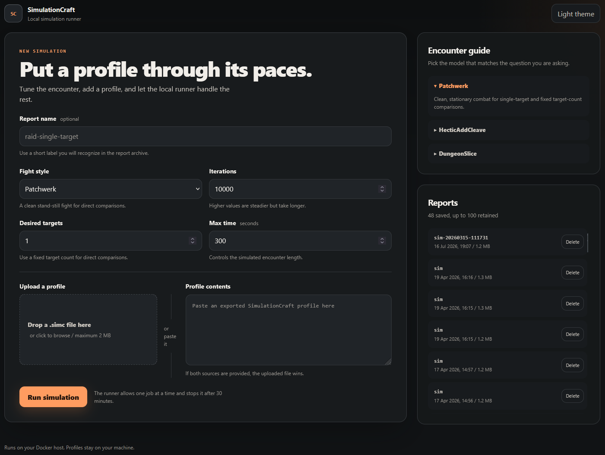
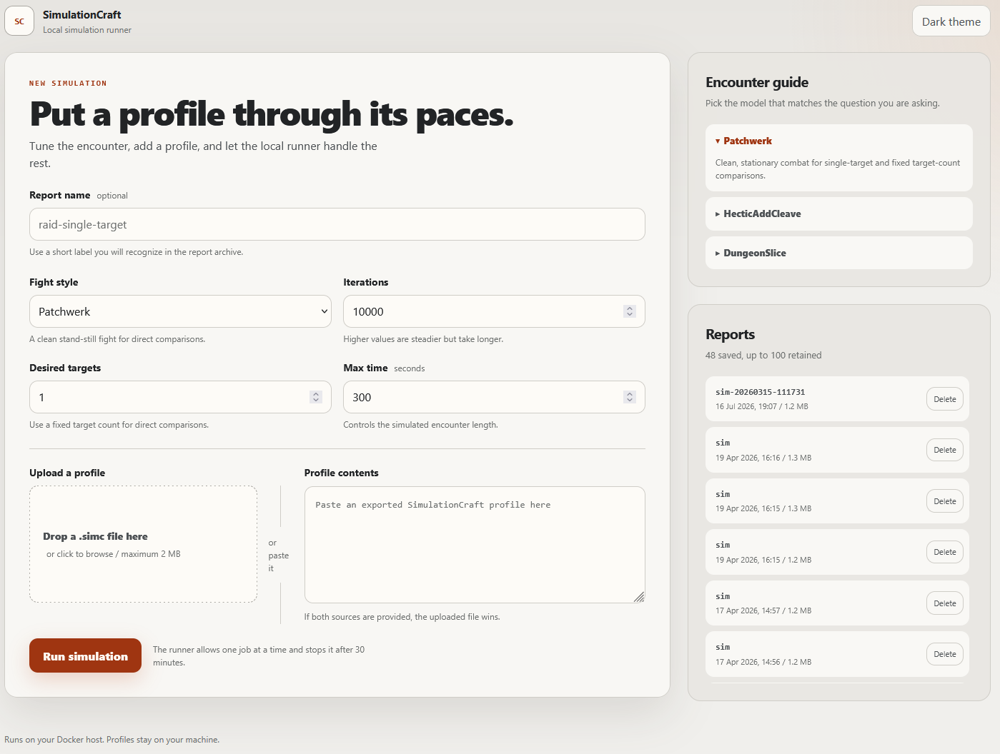

# SimC Local Runner

[](https://github.com/Bromeego/SimC-Local-Runner/actions/workflows/ci.yml)
[](LICENSE)

A lightweight, self-hosted web interface for running
[SimulationCraft](https://www.simulationcraft.org/) profiles from a browser.

Upload a `.simc` or `.txt` profile (or paste one into the page), choose a fight
style and a few common settings, and the app runs the official SimulationCraft
Docker image. The generated HTML reports remain available from the home page.

## Preview

<p align="center">
  
  
</p>

## Why this project?

SimC Local Runner is the small, Docker-first option: no accounts, database,
external API keys, subscription, or multi-service stack. It is intended for a
trusted home server where you want to paste or drop in a profile and get the
official SimulationCraft HTML report back.

It deliberately does not try to replace full optimization tools such as
Raidbots or larger local suites. The focus is a polished path from profile to
report that is easy to understand and maintain.

## Features

- Click, drag and drop, or paste a SimulationCraft profile
- Patchwerk, HecticAddCleave, and DungeonSlice fight styles
- Controls for iterations, desired targets, and maximum fight time
- Saved input profiles and HTML reports
- Report metadata, manual deletion, and automatic retention
- Reproducibility metadata with image digest, SimC version, settings, and run time
- Compact nightly-build badge with WoW, hotfix, source commit, and image details
- Automatic SimulationCraft image updates before every run
- Bounded uploads, simulation concurrency, and run time
- Threaded Gunicorn serving with a container health check
- Responsive light and dark interface
- Simple Docker Compose deployment

## Requirements

- A Linux host with Docker Engine and Docker Compose
- Permission to access the Docker socket
- An absolute host path for the deployment and its saved data

The app runs a second container for each simulation. It therefore mounts the
host Docker socket and needs the host's absolute paths to the `input` and
`output` directories.

## Quick start

1. Clone the repository and enter its directory:

   ```sh
   git clone https://github.com/Bromeego/SimC-Local-Runner.git
   cd SimC-Local-Runner
   ```

2. Create the data directories:

   ```sh
   mkdir -p input output
   ```

3. Copy the example configuration:

   ```sh
   cp .env.example .env
   ```

4. Edit `.env` and set `SIMC_WEB_ROOT` to the absolute path of this directory
   on the Docker host. For example:

   ```dotenv
   SIMC_WEB_ROOT=/srv/simc-web
   ```

5. Pull the published image and start the app:

   ```sh
   docker compose pull
   docker compose up -d
   ```

6. Open `http://HOSTNAME-OR-IP:8088`.

View logs with:

```sh
docker compose logs -f simc-web
```

Stop the app with:

```sh
docker compose down
```

### Building locally

The default Compose file uses the published `linux/amd64` or `linux/arm64`
image from GitHub Container Registry. To build the web app from this checkout
instead, add the local-build override:

```sh
docker compose -f compose.yaml -f compose.build.yaml up -d --build
```

Remove the override when you want to return to the published image. Release
tags such as `v0.1.0` also produce matching container image tags, which can be
set with `SIMC_WEB_IMAGE` when you prefer to pin a version.

## Configuration

The example values live in [`.env.example`](.env.example).

| Variable | Default | Purpose |
| --- | --- | --- |
| `SIMC_WEB_ROOT` | Required | Absolute host path to the deployment directory |
| `SIMC_WEB_PORT` | `8088` | Port exposed by the web app |
| `SIMC_WEB_IMAGE` | `ghcr.io/bromeego/simc-local-runner:latest` | Web interface image used by Compose |
| `TZ` | `UTC` | Container timezone, using an IANA timezone name |
| `SIMC_IMAGE` | `simulationcraftorg/simc:latest` | SimulationCraft image used for runs |
| `SIMC_PULL_POLICY` | `always` | Engine image policy: `always`, `missing`, or `never` |
| `SIMC_CPUS` | Unset | Optional CPU limit passed to each simulation container |
| `SIMC_MEMORY` | Unset | Optional memory limit such as `4g` |
| `SIMC_TIMEOUT_SECONDS` | `1800` | Stops a simulation that exceeds this run time |
| `MAX_UPLOAD_MB` | `2` | Maximum request and profile upload size |
| `MAX_CONCURRENT_SIMS` | `1` | Simulation jobs accepted at once |
| `REPORT_RETENTION_COUNT` | `100` | Reports retained after a successful run |
| `WEB_THREADS` | `4` | Web threads for pages and long-running requests |

`SIMC_WEB_ROOT` must be a host path, not a path inside the web container. The
web app passes it to the Docker daemon when launching SimulationCraft.

Before every simulation, the default `always` pull policy asks Docker for the
current `SIMC_IMAGE`. Docker reuses existing image layers when the registry copy
has not changed. This keeps `simulationcraftorg/simc:latest` current across game
patches and model updates without a separate maintenance job.

Use `missing` to pull only when the image is absent, or `never` for a completely
offline or locally built image. Those modes can continue using a cached engine
after a newer registry image becomes available.

## Usage

Export a profile from SimulationCraft or an addon that produces SimulationCraft
input, then upload the file or paste its contents into the page. If both are
provided, the uploaded file takes precedence.

The values chosen in the web interface replace any existing `fight_style`,
`iterations`, `desired_targets`, and `max_time` settings in the submitted
profile. DungeonSlice uses its own target flow and timing, so `desired_targets`
and `max_time` are not added for that fight style.

Generated inputs are stored in `input/`, and generated reports are stored in
`output/`. These directories are excluded from Git because profiles and reports
can contain character information and can grow over time.

Each successful report also gets a matching `.json` metadata file in `output/`.
It records the exact SimulationCraft image digest when Docker exposes one, the
version line reported by SimC, chosen settings, UTC creation time, and wall-clock
run duration. This makes it much easier to reproduce or explain an older result.

The header badge shows the SimulationCraft nightly used by the latest completed
report. Hover over it, focus it with the keyboard, or select it on a touch device
to see the matching WoW build, hotfix, upstream commit, and container digest. The
update note in the same panel reflects the configured `SIMC_PULL_POLICY`.

Deleting a report from the interface also deletes its matching saved input.
After each successful run, the oldest report and matching input are removed when
the configured retention count is exceeded.

## Updating

Pull the latest project and container changes:

```sh
git pull
docker compose pull simc-web
docker compose up -d
```

The runner refreshes the configured SimulationCraft engine automatically when
the next simulation starts. Existing inputs and reports remain in their
bind-mounted directories.

For a local build, use the two-file command from the Building locally section
after pulling the latest project changes.

## Project layout

```text
.
|-- app/
|   |-- app.py
|   |-- Dockerfile
|   |-- gunicorn.conf.py
|   |-- static/
|   |-- templates/
|   `-- requirements.txt
|-- input/                 # Submitted profiles (generated, not committed)
|-- output/                # HTML reports (generated, not committed)
|-- docs/screenshots/      # README previews
|-- examples/demo.simc     # Anonymous profile for smoke testing
|-- tests/
|-- .github/               # Checks, image publishing, and issue templates
|-- CHANGELOG.md
|-- CONTRIBUTING.md
|-- LICENSE
|-- SECURITY.md
|-- .env.example
|-- compose.build.yaml     # Local source-build override
`-- compose.yaml           # Published-image deployment
```

## Troubleshooting

### Docker socket permission errors

The web container must be able to use `/var/run/docker.sock`. Confirm Docker is
running and that the socket is mounted as shown in `compose.yaml`.

### Simulation starts but no report appears

Check the app logs and verify that `SIMC_WEB_ROOT` exactly matches the absolute
deployment path on the Docker host. The `input/` and `output/` directories must
also be writable.

### SimulationCraft image cannot be pulled

Pull it directly to see the underlying Docker error:

```sh
docker pull simulationcraftorg/simc:latest
```

## Security

This is currently a trusted-network/homelab app. It has no authentication,
rate limiting, or per-user isolation. It also mounts the Docker socket, which is
a highly privileged host capability.

Do not expose the app directly to the public internet. If remote access is
needed, place it behind a reverse proxy with TLS and authentication, restrict
network access, and keep Docker and the images up to date.

## Development checks

Install the app requirements, then run the standard-library test suite:

```sh
python -m pip install -r app/requirements.txt
python -m unittest discover -s tests -v
```

Validate the deployment and build the web image with:

```sh
SIMC_WEB_ROOT=/tmp/simc-web docker compose config --quiet
SIMC_WEB_ROOT=/tmp/simc-web docker compose -f compose.yaml -f compose.build.yaml config --quiet
docker build -t simc-web:test app
```

On a Linux Docker host, run the real engine smoke test with:

```sh
sh tests/smoke-test.sh
```

GitHub Actions runs the unit, Compose, and image-build checks for every pull
request. A separate scheduled workflow runs the anonymous demo profile against
the latest official SimulationCraft image each week.

## Contributing

Issues and focused pull requests are welcome. Please read
[`CONTRIBUTING.md`](CONTRIBUTING.md), especially the note about removing
character and host information from profiles, reports, screenshots, and logs.
Security problems should be reported privately as described in
[`SECURITY.md`](SECURITY.md).

## Upstream projects and trademarks

This project is a web runner for the official
[`simulationcraft/simc`](https://github.com/simulationcraft/simc) engine and its
[`simulationcraftorg/simc`](https://hub.docker.com/r/simulationcraftorg/simc)
container image. SimulationCraft's contributors deserve the credit for the
simulator and its maintained class models.

SimC Local Runner is an independent community project. It is not affiliated
with or endorsed by the SimulationCraft project, Raidbots, or Blizzard
Entertainment. World of Warcraft and Blizzard Entertainment are trademarks or
registered trademarks of Blizzard Entertainment, Inc.

## License

The simc-web source code is available under the [MIT License](LICENSE). The
SimulationCraft engine and other upstream components retain their own licenses.
